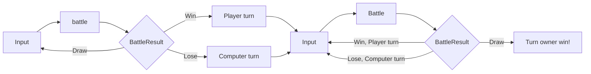

# 묵찌빠 프로젝트 :fist::v::hand:
### 목차:zap:
- [팀원](#팀원sunglasses)
- [파일구조](#파일구조file_folder)
- [흐름도](#흐름도ocean)
- [실행화면](#실행화면video_game)
- [고민한점](#고민한점astonished)

## 팀원:sunglasses:

| 프로필 사진 |  |  |
| ---- | ----------- | --------- |
| in Github | @newJunsung | @SimJaeHyeok |
| in SeSAC | 뉴준성 | JaeHyeok |

[목차로 이동](#목차zap)

## 파일구조:file_folder:
- RockPaperScissors
  + BattleResult.swift
  + main.swift
  + PlayingGameException.swift
  + RockPaperScissors.swift
  + RockPaperScissors.swift

[목차로 이동](#목차zap)

## 흐름도:ocean:

[목차로 이동](#목차zap)

## 실행화면:video_game:
### 가위바위보
- **승리**

- **패배**

- **입력 오류**

- **종료**

### 묵찌빠
- **승리**

- **패배**

- **입력 오류**

- **종료**

[목차로 이동](#목차zap)

## 고민한점:astonished:
* Comparable를 이용한 상성 관계 표현
 
   
가위바위보 프로젝트를 진행하면서 가위바위보의 상성 관계를 어떻게 구현할 것 인가에 대한 고민을 많이 했었다. 처음엔 숫자로 조건을 분기하여 상성 관계를 구현했지만,
Comparable Protocol을 사용해서 상성 관계를 구현하여 코드가 간결해지고 가독성이 더 좋아졌고, 가위바위보 프로젝트에 이어 묵찌빠 프로젝트를 사용할 때에도 상성 관계를 이용하여 코드를 더욱 쉽게 작성할 수 있었다.

[목차로 이동](#목차zap)
